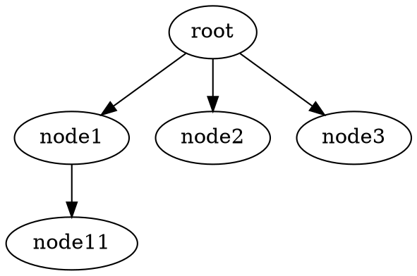

# tree-datastructure


[](https://dev.azure.com/couturiervalentin/couturiervalentin/_build/latest?definitionId=1&branchName=master)

This package allow creating simple tree datastructures.

## Installation

```Node
npm install @coutcout/tree-datastructure
```

## Use

### Create a tree

```Typescript
let tree = new Tree("This is the root");
```

### Get the root

```Typescript
let root = tree.getRoot();
```

### Add a node to the tree

```Typescript
let node1 = root.addChild("I'm the first childNode");
let node11 = node1.addChild("Hi");
let node2 = root.addChild("I'm the second child");

let node3 = new TreeNode("Bye bye");
root.addChildTreeNode(node3);
```

### Result



### Get a parent

```Typescript
let parent1 = node11.getParent(1);
// parent = root

let parent2 = node11.getParent();
// parent = node1
```

### Get childs

```Typescript
let childs = root.getChilds();
// childs = [node1, node2, node3]
```
